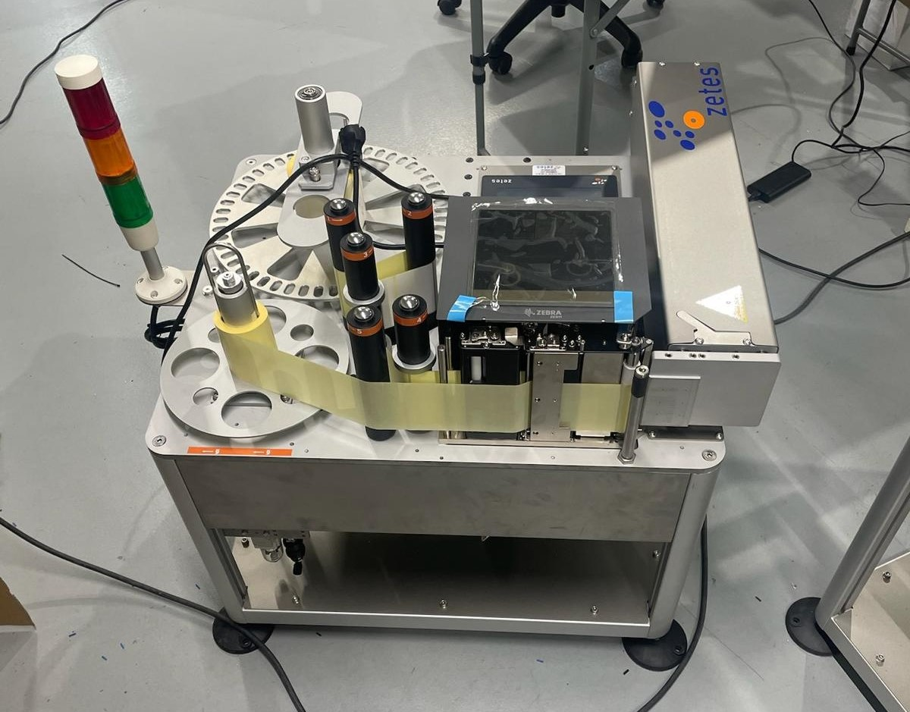

**Nota:** Este caso de estudio muestra un proyecto real de automatización industrial orientado a trazabilidad, control de calidad y etiquetado automático en línea de producción.

**Descripción general del proyecto:**  
Diseño e implementación de una **estación automática de etiquetado 4 caras** para cajas industriales. El sistema gestiona el posicionamiento preciso del producto, la impresión y aplicación de etiquetas, y la **verificación del código QR mediante visión artificial**, garantizando que ningún producto salga de la estación sin una identificación válida y legible.

---

## 🛠️ Tecnologías

  
  
    
  
  
  
  

- **PLC:** 2x Siemens SIMATIC S7-1200 (Arquitectura Maestro–Esclavo)  
- **HMI:** Siemens KTP700 Basic y NB3Q-TW00B-V1
- **Motion Control:** Servomotor Panasonic MINAS LIQI (Control PTO)  
- **Visión Artificial:** Cámara Cognex In-Sight 8000  
- **Impresión:** Zebra ZE500 (motor de impresión industrial)  
- **Comunicaciones:** Profinet, TCP/IP, FTP  
- **Neumática:** Vacío y soplado para transferencia de etiquetas  
- **Software:** TIA Portal V17 + Maewin (Etiquetas) + NB-Designer + In‑Sight Explorer + PANATERM (driver)

---

## 🔄 Workflow del Proyecto

### 1. Análisis del Problema y Definición de Requisitos 🎯
- Definición de requisitos funcionales clave:
  - Etiquetado correcto en las **4 caras**
  - Alta precisión de posicionamiento
  - Verificación mediante **visión artificial**
  - Integración con sistemas industriales existentes
  - Gestión de errores y rechazo de piezas defectuosas

---

### 2. Diseño Conceptual del Sistema
- Diseño de una **arquitectura modular y escalable**, compuesta por:
  - Sistema de posicionamiento con **servomotores**
  - Estación de etiquetado neumatico sincronizada
  - Sistema de visión artificial para validación
  - Control centralizado mediante **PLC's**
  - **HMI's** para operación y diagnóstico
- Definición de la arquitectura general, señales de control y comunicaciones entre dispositivos.

---

### 3. Selección de Hardware y Tecnologías
- Selección de componentes industriales orientados a **fiabilidad y robustez**:
  - **PLC’s** para el control del proceso
  - **Servomotor + driver** para posicionamiento preciso
  - Cámara de **visión artificial** para verificación
  - **HMI's** para supervisión y control del sistema
  - **Impresora de etiquetas**
  - **Sensores y sistema neumatico** para funcionamiento de la estacion de etiquetado
  - Comunicaciones industriales para la sincronización de equipos

---

### 4. Desarrollo del Software de Control
- Programación de los PLC’s siguiendo una **arquitectura modular**, separando:
  - Control de movimiento
  - Lógica de secuencias
  - Gestión de impresión
  - Gestión del sistema de visión artificial
  - Manejo de errores y alarmas
- Enfoque orientado a un sistema **mantenible y fácilmente escalable**.

---

### 5. Integración de Visión Artificial e Impresión
- Implementación de un sistema integrado encargado de:
  - Impresión de etiquetas
  - Verificación de la impresión
  - Comprobación de la posición y orientación de las etiquetas
  - Validación de la calidad del etiquetado
  - Envío de señales **OK / NOK** al PLC
- Rechazo automático de productos defectuosos y registro de incidencias.

---

### 6. Desarrollo de la Interfaz HMI
- Diseño de una HMI orientada al operario que permite:
  - Supervisión del estado del sistema en tiempo real
  - Ajuste de parámetros de proceso 
  - Visualización de alarmas y errores
  - Facilitación de tareas de mantenimiento y diagnóstico

---

### 7. Pruebas y Puesta en Marcha
- Ejecución de pruebas en distintas fases:
  - Pruebas individuales de cada módulo
  - Pruebas de integración del sistema completo
  - Ajuste de precisión y tiempos de ciclo
  - Validación del sistema de visión artificial

---

### 8. Optimización y Validación Final
- Optimización del sistema tras la puesta en marcha:
  - Reducción de tiempos de ciclo
  - Mejora de la precisión del etiquetado
  - Optimización de la gestión de errores
  - Aumento de la estabilidad general del sistema
- Validación final en entorno industrial.

---

### 9. Resultados Obtenidos
- Automatización completa del proceso de etiquetado
- Reducción significativa de errores humanos
- Mejora de la trazabilidad del producto
- Aumento de la eficiencia y repetibilidad del proceso

### 10. Diagrama de Arquitectura

---

## 📂 Documentación del Proyecto

- **Manual de Usuario:** Operación, seguridad y prevención de riesgos. 
[⬇️ Descargar Manual de Usuario (PDF)](/pdf/MANUAL_USUARIO.pdf)

- **Manual de Funcionamiento:** Lógica de control, secuencias y estados GEMMA. 
[⬇️ Descargar Manual de Usuario (PDF)](/pdf/MANUAL_USUARIO.pdf)

- **Manual de Comunicaciones:** Red, direcciones IP y protocolos de datos. 
[⬇️ Descargar Manual de Comunicaciones (PDF)](/pdf/MANUAL_USUARIO.pdf)

- **Manual de HMI:** Guia para el operario. 
[⬇️ Descargar Manual de HMI (PDF)](/pdf/MANUAL_USUARIO.pdf)

- **Manual de Grafet y Programa:** Construccion del programa de manera interna. 
[⬇️ Descargar Manual de Grafet y Programa (PDF)](/pdf/MANUAL_USUARIO.pdf)

---

